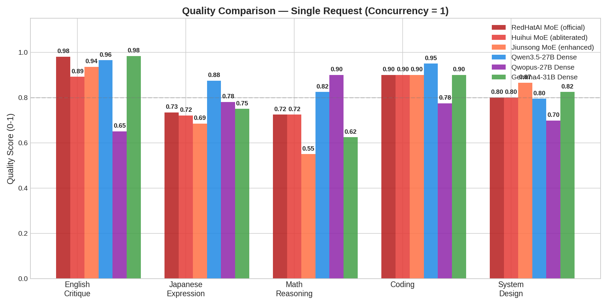
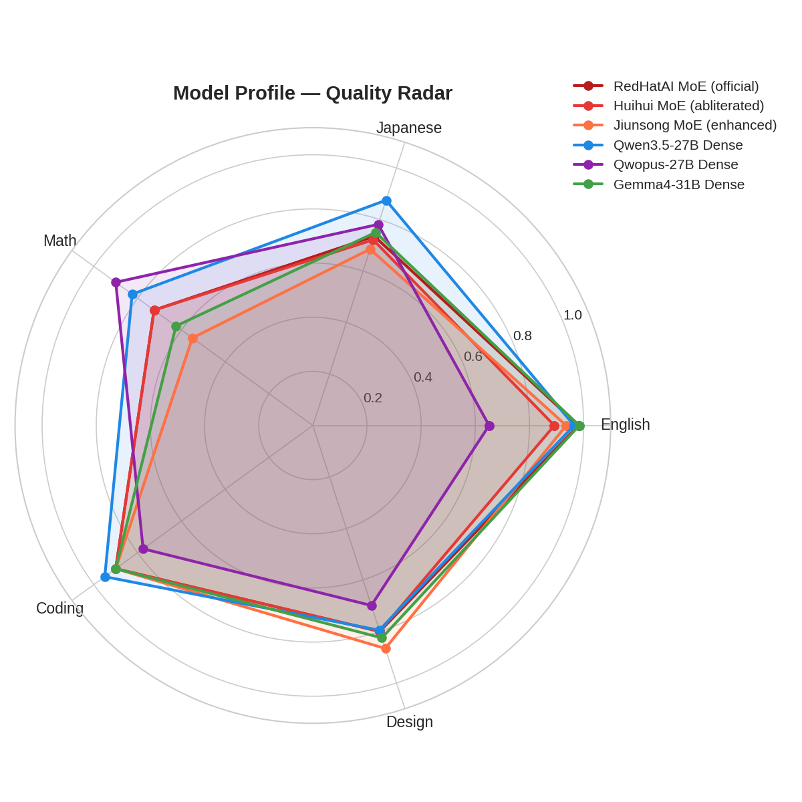
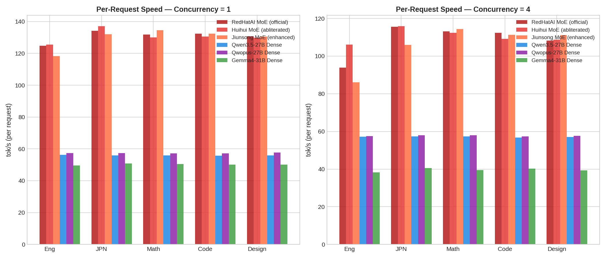
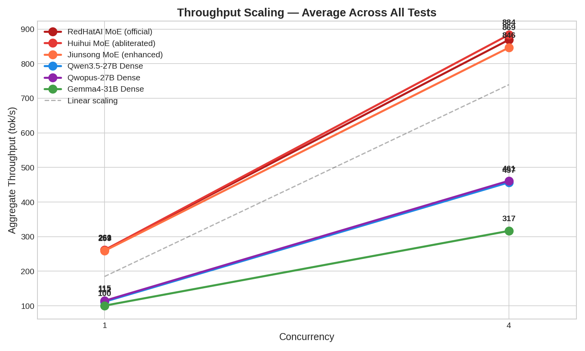
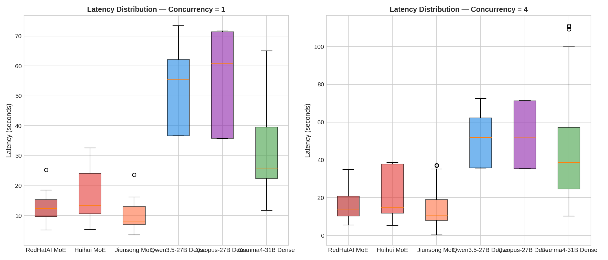
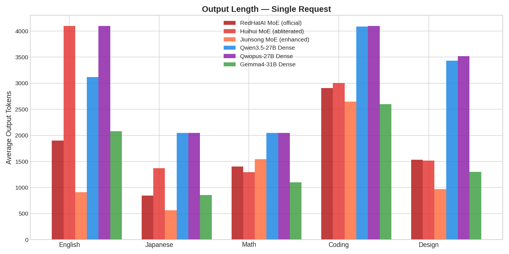

# NVFP4 Showdown: MoE vs Dense — 6 Models on 6 GPUs

**The definitive comparison: 3 MoE models (3.8B active) vs 3 Dense models (27-31B active), all NVFP4 on NVIDIA Blackwell with FP8 KV cache at 128K context.**

MoE is fast. Dense is smart. Here's exactly how much.

## Models

### MoE (Gemma 4 26B-A4B, 3.8B active per token)

| Model | Variant | Source | Size |
|-------|---------|--------|------|
| **RedHatAI** | Official (censored) | [HF](https://huggingface.co/RedHatAI/gemma-4-26B-A4B-it-NVFP4) | 16.5 GB |
| **Huihui** | Abliterated | [HF](https://huggingface.co/sakamakismile/Huihui-gemma-4-26B-A4B-it-abliterated-NVFP4) | 16.5 GB |
| **Jiunsong** | Enhanced | [HF](https://huggingface.co/sakamakismile/SuperGemma4-26B-Abliterated-Multimodal-NVFP4) | 16.5 GB |

### Dense (full parameter activation)

| Model | Params Active | Source | Size |
|-------|:------------:|--------|------|
| **Qwen3.5-27B** | 27B | [HF](https://huggingface.co/sakamakismile/Huihui-Qwen3.5-27B-abliterated-NVFP4) | 20.6 GB |
| **Qwopus3.5-27B** | 27B (Opus distilled) | [HF](https://huggingface.co/sakamakismile/Huihui-Qwopus3.5-27B-v3-abliterated-NVFP4) | 19.8 GB |
| **Gemma4-31B** | 31B | [HF](https://huggingface.co/sakamakismile/Huihui-gemma-4-31B-it-abliterated-v2-NVFP4) | 20.5 GB |

## Hardware

- **6x NVIDIA RTX PRO 6000 Blackwell** (96 GB each) — 1 model per GPU
- **128K context**, FP8 KV cache, CUDA Graph PIECEWISE
- **vLLM 0.19.1rc1** nightly (cu130)

## The Verdict: Speed vs Intelligence



### Quality Scores (Concurrency = 1)

| Test | RedHat MoE | Huihui MoE | Jiunsong MoE | Qwen Dense | Qwopus Dense | Gemma31 Dense |
|------|:----------:|:----------:|:------------:|:----------:|:------------:|:-------------:|
| **English** | **0.98** | 0.89 | 0.94 | 0.97 | 0.65 | **0.98** |
| **Japanese** | 0.74 | 0.72 | 0.69 | **0.88** | 0.78 | 0.75 |
| **Math** | 0.73 | 0.73 | 0.55 | 0.83 | **0.90** | 0.63 |
| **Coding** | 0.90 | 0.90 | 0.90 | **0.95** | 0.78 | 0.90 |
| **Design** | 0.80 | 0.80 | **0.87** | 0.80 | 0.70 | 0.83 |



### Speed (tok/s)



| Model | Type | x1 tok/s | x4 (per-req) | x4 (aggregate) |
|-------|:----:|:--------:|:------------:|:--------------:|
| RedHatAI | MoE | **131** | 109 | **869** |
| Huihui | MoE | **130** | 109 | **864** |
| Jiunsong | MoE | **130** | 106 | **847** |
| Qwen3.5 | Dense | 56 | 57 | 457 |
| Qwopus | Dense | 57 | 58 | 461 |
| Gemma4-31B | Dense | 50 | 39 | 316 |



## MoE vs Dense: The Trade-off

| Metric | MoE (avg) | Dense (avg) | Winner | Margin |
|--------|:---------:|:-----------:|:------:|:------:|
| **Speed (x1)** | 130 tok/s | 54 tok/s | **MoE** | **2.4x faster** |
| **Throughput (x4)** | 860 tok/s | 411 tok/s | **MoE** | **2.1x** |
| **English** | 0.94 | 0.87 | MoE | +8% |
| **Japanese** | 0.72 | **0.80** | **Dense** | +11% |
| **Math** | 0.67 | **0.79** | **Dense** | +18% |
| **Coding** | 0.90 | **0.88** | Tie | - |
| **Design** | 0.82 | 0.78 | Tie | - |
| **VRAM** | 92.9 GB | 93.0 GB | Tie | - |

### What this means

**MoE models are 2.4x faster with comparable quality for English and coding tasks.** But Dense models pull ahead on reasoning-heavy tasks (math +18%, Japanese +11%) — because running all 27-31B parameters on every token allows deeper contextual reasoning.

> Note: Quality differences within each group (MoE-to-MoE, Dense-to-Dense) are within noise (n=2 per test). The MoE-vs-Dense gap is real and consistent.

## VRAM Usage @ 128K Context (FP8 KV)

| GPU | Model | Type | VRAM |
|:---:|-------|:----:|:----:|
| 0 | RedHatAI | MoE | 92,862 MB |
| 1 | Huihui | MoE | 92,862 MB |
| 2 | Jiunsong | MoE | 92,862 MB |
| 3 | Qwen3.5 | Dense | 92,470 MB |
| 4 | Qwopus | Dense | 92,470 MB |
| 5 | Gemma4-31B | Dense | 94,208 MB |

VRAM is nearly identical — NVFP4 brings both architectures to the same ~20 GB weight footprint.





## Which Should You Deploy?

| Scenario | Choose | Why |
|----------|--------|-----|
| **High-throughput API** | MoE (Huihui) | 860 tok/s aggregate, abliterated |
| **Agent/tool-calling** | MoE (any) | Fast response, coding 0.90 |
| **Math / reasoning** | Dense (Qwopus) | 0.90 math, Opus distillation |
| **Japanese / multilingual** | Dense (Qwen3.5) | 0.88 Japanese |
| **English writing** | Either (RedHat MoE or Gemma31 Dense) | Both 0.98 |
| **6-GPU fleet** | Mix both | MoE for speed lanes, Dense for quality lanes |

### The Fleet Strategy

On a 6-GPU node like this benchmark:
- **GPU 0-2: MoE** — handle high-volume requests (search, summarization, translation)
- **GPU 3-5: Dense** — handle quality-critical requests (reasoning, coding, analysis)
- Route by task type → best of both worlds

## Reproducibility

```bash
git clone https://github.com/lna-lab/27b-31b-nvfp4-bench
cd 27b-31b-nvfp4-bench

# Start all 6 models
docker compose -f docker-compose.bench-all6.yml up -d

# Run benchmark
pip install aiohttp
python bench.py --output results/benchmark_all6.json

# Generate figures
pip install matplotlib
python generate_figures.py
```

## Scoring Methodology

Quality scores are **automated heuristics** (text structure, vocabulary diversity, code correctness indicators). They provide relative ranking within this benchmark, not absolute quality assessment. Differences within the same architecture class (MoE-to-MoE, Dense-to-Dense) are within measurement noise at n=2 prompts per test. The MoE-vs-Dense gap is consistent and real.

## License

Benchmark code: MIT. Models subject to their respective licenses.

## Credits

- Models: [huihui-ai](https://huggingface.co/huihui-ai), [Jiunsong](https://huggingface.co/Jiunsong), [RedHatAI](https://huggingface.co/RedHatAI), [Google](https://huggingface.co/google), [Qwen](https://huggingface.co/Qwen), [Jackrong](https://huggingface.co/Jackrong)
- Quantization: [llm-compressor](https://github.com/vllm-project/llm-compressor)
- Benchmark: [Lna-Lab](https://github.com/lna-lab)
